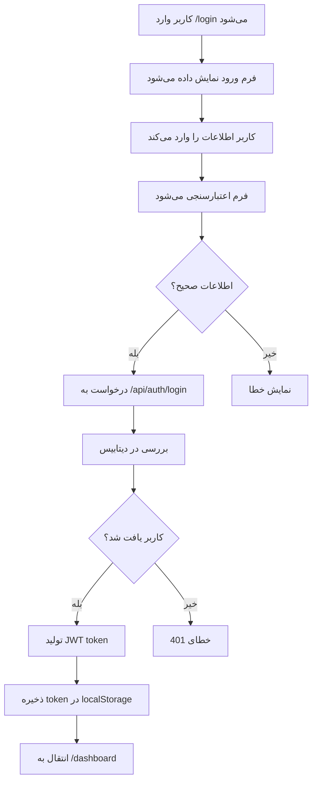

# 🔐 تست کامل ماژول احراز هویت (Authentication)

## 📊 وضعیت کلی ماژول
- **درصد تکمیل:** 90%
- **اولویت:** 🔴 HIGH
- **وضعیت تست:** 🔄 در حال تست
- **تاریخ تست:** 12 آگوست 2025

---

## 🎯 اهداف تست

### ✅ عملکردهای موجود برای تست:
1. **ورود کاربر** (Login)
2. **ثبت‌نام کاربر** (Register) 
3. **خروج از سیستم** (Logout)
4. **بازیابی رمز عبور** (Password Reset)
5. **مدیریت نشست‌ها** (Session Management)
6. **کنترل دسترسی** (Access Control)

### ❌ عملکردهای ناقص (10% باقی‌مانده):
- Two-Factor Authentication (2FA)
- بازیابی پیشرفته رمز (SMS/Email)
- لاگ ورود و خروج کاربران

---

## 🗂️ ساختار فایل‌های احراز هویت

### 📁 فایل‌های کلیدی برای بررسی:
```
app/auth/
├── login/
│   └── page.tsx          # صفحه ورود
├── register/
│   └── page.tsx          # صفحه ثبت‌نام
└── reset-password/
    └── page.tsx          # بازیابی رمز

components/auth/
├── LoginForm.tsx         # فرم ورود
├── RegisterForm.tsx      # فرم ثبت‌نام
└── ResetPasswordForm.tsx # فرم بازیابی

api/auth/
├── login/
├── register/
├── logout/
└── reset-password/

lib/
├── auth.ts              # لاجیک احراز هویت
└── auth-headers.ts      # هدرهای امنیتی
```

---

## 🧪 آزمایش‌های فنی

### 1. تست API Endpoints

#### 🔍 `/api/auth/login` - POST
**انتظارات:**
- Status Code: 200 (موفق) یا 401 (خطا)
- Response: JWT token + user data
- Error Handling: پیام‌های خطای مناسب

**تست‌های مورد نیاز:**
- [ ] ورود با اطلاعات صحیح
- [ ] ورود با رمز اشتباه
- [ ] ورود با ایمیل نامعتبر
- [ ] ورود بدون اطلاعات
- [ ] Rate limiting (محدودیت تعداد درخواست)

#### 🔍 `/api/auth/register` - POST
**انتظارات:**
- Status Code: 201 (ایجاد شده) یا 400 (خطا)
- Response: user data بدون password
- Validation: اعتبارسنجی قوی

**تست‌های مورد نیاز:**
- [ ] ثبت‌نام با اطلاعات صحیح
- [ ] ثبت‌نام با ایمیل تکراری
- [ ] ثبت‌نام با رمز ضعیف
- [ ] اعتبارسنجی فیلدهای اجباری

#### 🔍 `/api/auth/logout` - POST
**انتظارات:**
- Status Code: 200
- Token invalidation
- Session cleanup

**تست‌های مورد نیاز:**
- [ ] خروج موفق از سیستم
- [ ] تست token invalidation
- [ ] چندین دستگاه همزمان

### 2. تست Database Operations

#### 🗄️ User Model بررسی
```prisma
model User {
  id        String   @id @default(cuid())
  email     String   @unique
  password  String   # هش شده با bcrypt
  name      String?
  role      Role     @default(STAFF)
  createdAt DateTime @default(now())
  updatedAt DateTime @updatedAt
}
```

**تست‌های مورد نیاز:**
- [ ] ایجاد کاربر جدید
- [ ] بررسی unique constraint روی email
- [ ] هش کردن password
- [ ] تنظیم role پیش‌فرض
- [ ] timestamp های created/updated

### 3. تست Security

#### 🛡️ Password Security
- [ ] Hash algorithm: bcrypt با salt rounds >= 12
- [ ] Minimum length: 8 characters
- [ ] Password complexity validation
- [ ] No plain text storage

#### 🔐 JWT Security
- [ ] Secret key قوی و secure
- [ ] Expiration time مناسب (24h)
- [ ] Proper payload structure
- [ ] Token verification process

#### 🚫 Attack Prevention
- [ ] SQL Injection prevention
- [ ] XSS protection
- [ ] CSRF protection
- [ ] Rate limiting
- [ ] Input sanitization

---

## 🎨 تست‌های UI/UX

### 1. صفحه ورود (`/auth/login`)

#### 📱 Responsive Design
- [ ] موبایل (320px - 768px): فرم تمام عرض
- [ ] تبلت (768px - 1024px): فرم در مرکز
- [ ] دسکتاپ (1024px+): فرم در کارت مرکزی

#### 🎨 Visual Design
- [ ] رنگ‌های اصلی: #1890ff (آبی) و #52c41a (سبز)
- [ ] فونت فارسی: Vazirmatn
- [ ] فونت انگلیسی: Roboto
- [ ] Spacing مناسب: 16px، 24px، 32px
- [ ] Shadow و border radius: 8px

#### 🔄 User Experience
- [ ] Loading state هنگام ورود
- [ ] Error messages واضح و فارسی
- [ ] Success notification
- [ ] Remember me checkbox
- [ ] Forgot password link
- [ ] Register page redirect

### 2. صفحه ثبت‌نام (`/auth/register`)

#### 📝 Form Validation
- [ ] Real-time validation
- [ ] Error messages زیر هر field
- [ ] Success states
- [ ] Password strength indicator
- [ ] Confirm password matching

#### 🎯 Required Fields
- [ ] نام (Name) - اختیاری
- [ ] ایمیل (Email) - اجباری + validation
- [ ] رمز عبور (Password) - اجباری + rules
- [ ] تکرار رمز (Confirm Password) - اجباری
- [ ] نقش (Role) - انتخاب از لیست

### 3. صفحه بازیابی رمز (`/auth/reset-password`)

#### ✉️ Email Process
- [ ] ارسال ایمیل بازیابی
- [ ] Link با token موقت
- [ ] صفحه تنظیم رمز جدید
- [ ] تایید تغییر رمز

---

## 🔗 تست‌های Integration

### 1. جریان کامل ورود


### 2. کنترل دسترسی
- [ ] کاربر ورود نکرده: انتقال به /login
- [ ] Token منقضی: logout خودکار
- [ ] Role-based redirects
- [ ] Protected routes middleware

### 3. Session Management
- [ ] Multi-device support
- [ ] Token refresh mechanism
- [ ] Logout from all devices
- [ ] Session timeout handling

---

## ⚡ تست‌های Performance

### 1. Login Speed
- [ ] Form render time < 100ms
- [ ] API response time < 500ms
- [ ] Total login process < 2s
- [ ] Smooth animations

### 2. Bundle Size
- [ ] Auth component size < 100KB
- [ ] Code splitting implemented
- [ ] Lazy loading for heavy components

---

## 🐛 سناریوهای خطا

### 1. Network Errors
- [ ] Internet disconnection
- [ ] Server timeout
- [ ] API server down
- [ ] Slow connection handling

### 2. Validation Errors
- [ ] Empty form submission
- [ ] Invalid email format
- [ ] Weak password
- [ ] Mismatched passwords

### 3. Server Errors
- [ ] Database connection issues
- [ ] JWT generation failure
- [ ] Email service down

---

## ✅ چک‌لیست نهایی

### Frontend Tests
- [ ] صفحه login صحیح کار می‌کند
- [ ] صفحه register صحیح کار می‌کند
- [ ] صفحه reset-password صحیح کار می‌کند
- [ ] فرم‌ها responsive هستند
- [ ] Validation صحیح عمل می‌کند
- [ ] Error handling مناسب است
- [ ] Loading states پیاده‌سازی شده
- [ ] Success notifications کار می‌کند

### Backend Tests
- [ ] API /login صحیح کار می‌کند
- [ ] API /register صحیح کار می‌کند
- [ ] API /logout صحیح کار می‌کند
- [ ] JWT generation/verification صحیح است
- [ ] Password hashing صحیح است
- [ ] Database operations صحیح هستند
- [ ] Error responses مناسب هستند

### Security Tests
- [ ] Password securely hashed
- [ ] JWT properly configured
- [ ] Input validation complete
- [ ] SQL injection prevented
- [ ] XSS protection enabled
- [ ] Rate limiting implemented

### Integration Tests
- [ ] Login flow کامل کار می‌کند
- [ ] Register flow کامل کار می‌کند
- [ ] Logout flow کامل کار می‌کند
- [ ] Session management صحیح است
- [ ] Role-based access control کار می‌کند

---

## 🚀 مرحله بعدی

پس از تکمیل موفقیت‌آمیز این تست‌ها، انتقال به:
- **👥 تست ماژول نقش‌ها و دسترسی‌ها**
- **🏠 تست ماژول داشبورد اصلی**

---

**تاریخ آخرین به‌روزرسانی:** 12 آگوست 2025  
**وضعیت:** 🔄 آماده برای شروع تست عملی
